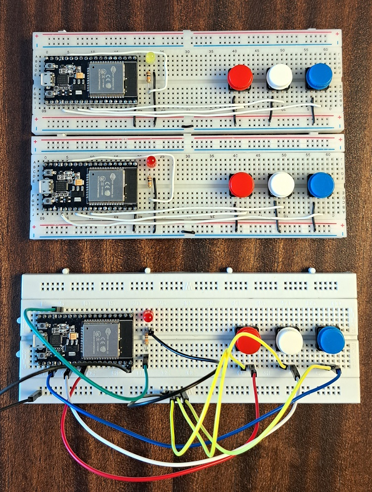
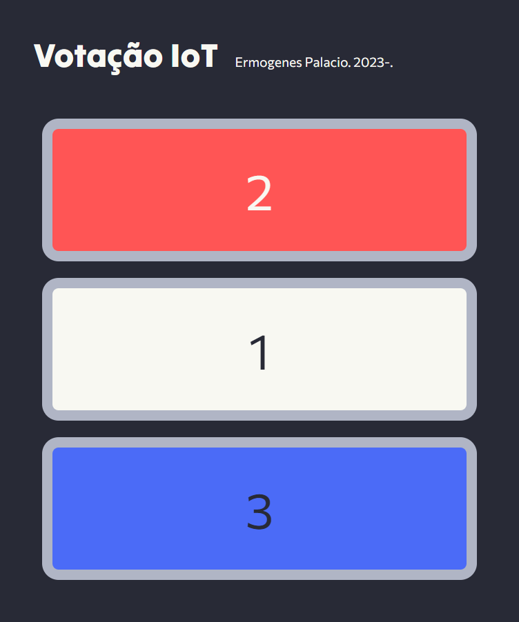

# iot-esp32-aspnetcore

Publicando dados colhidos com ESP32 usando ASP.NET Core

## Dispositivos

Hardware necessário: https://wokwi.com/projects/358909044834951169

[](art/protoboards.jpg)

<sup>_Cometi um erro ao encaixar os jumpers na protoboard inferior (as demais estão corretas). Você consegue identificá-lo?_</sup>

Faça as configurações necessárias [aqui](Urna/Urna.ino) e aplique nos dispositivos.

## Como usar

Baixe esse repo:

```sh
git clone https://github.com/ermogenes/iot-esp32-aspnetcore.git
```

Configure os endpoints das urnas criadas [aqui](VotacaoIoT/appsettings.json).

Inicie a aplicação:

```sh
dotnet run --project ./iot-esp32-aspnetcore/VotacaoIot/VotacaoIoT.csproj
```

Use https://localhost.run/ para tunelar localhost para a web:

```sh
ssh -R 80:localhost:5000 nokey@localhost.run
```


